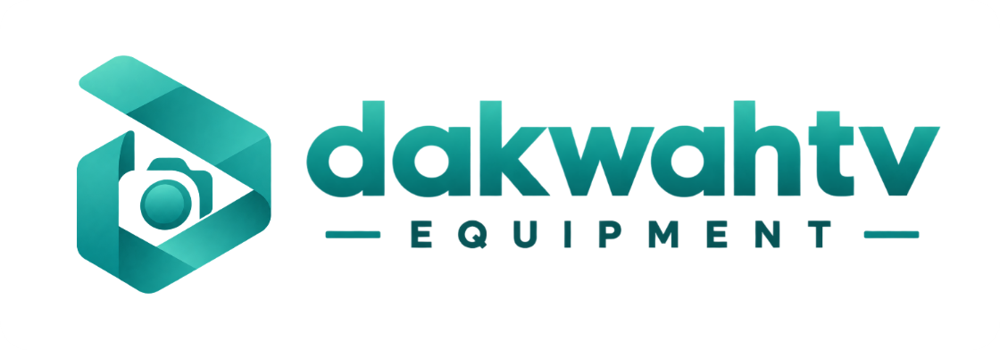
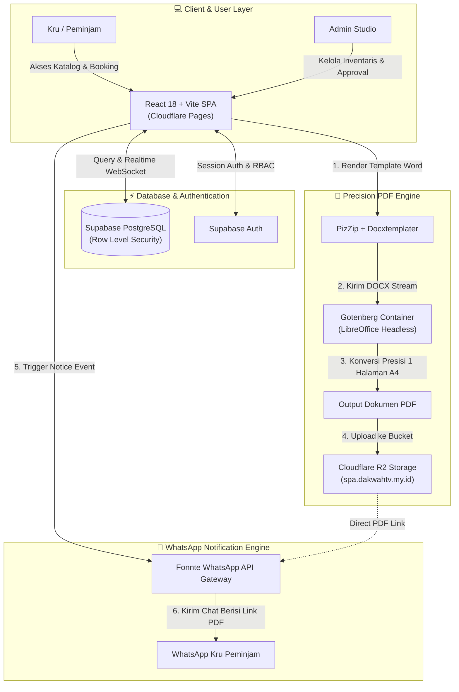

<div align="center">
  
  
  # 🎥 Dakwah TV Equipment Library
  ### Enterprise-Grade Production Equipment Management & Automated Letter Pipeline
  *Sistem Manajemen Inventaris & Peminjaman Alat Produksi Terpadu Dakwah TV UINSA*

  <br />

  [](https://github.com/huseinrosidstilllearn/dakwahtv-equipment/releases)
  [](https://react.dev/)
  [](https://vitejs.dev/)
  [](https://supabase.com/)
  [](https://cloudflare.com/)
  [](https://gotenberg.dev/)
  [](https://fonnte.com/)
  [](LICENSE)

  <br />

  [🌐 **Live Web Application**](https://dakwahtvequipment.pages.dev) • [📖 **Standar Operasional Prosedur (SOP)**](https://dakwahtvequipment.pages.dev/sop) • [🚀 **Release Notes v4.0.0**](RELEASE_NOTES.md)
</div>

<br />

---

## 📌 Tentang Sistem

**Dakwah TV Equipment Library** adalah platform *Single Page Application* (SPA) modern yang dirancang untuk mengelola inventaris, reservasi jadwal, dan administrasi peminjaman alat produksi media di laboratorium **Dakwah TV UIN Sunan Ampel Surabaya**.

Sistem ini memecahkan berbagai tantangan operasional studio penyiaran:
* 🚫 **Meniadakan Bentrok Jadwal (*Zero Double-Booking*):** Algoritma validasi jadwal otomatis mengunci alat yang sedang dipinjam oleh kru lain.
* ⚡ **Generator Surat Otomatis (SPA):** Pembuatan Surat Peminjaman Alat resmi berformat Microsoft Word (.docx) & PDF langsung dari data form tanpa input manual.
* ☁️ **Cloudflare R2 CDN Storage:** Penyimpanan dokumen PDF dengan domain kustom (`spa.dakwahtv.my.id`) berkecepatan tinggi dan bebas blokir ISP lokal.
* 🤖 **Notifikasi Otomatis Bot WhatsApp:** Informasi pengajuan, konfirmasi persetujuan dengan tautan unduh PDF langsung, hingga pengingat jadwal pengembalian alat dikirim via WhatsApp.
* 🛡️ **Pusat Kontrol Administrator 10-Modul:** Pengelolaan siklus alat dari persetujuan, serah terima (*pickup*), pengecekan kondisi fisik (*return checklist*), hingga log servis dan audit aktivitas.

---

## 🏗️ Arsitektur Sistem (v4.0.0)



---

## ✨ Fitur-Fitur Utama

### 🛒 1. Smart Booking & Deteksi Bentrok Jadwal
* **Realtime Conflict Checker:** Saat kru memilih rentang tanggal peminjaman, sistem otomatis mendeteksi ketersediaan setiap unit alat dan menonaktifkan tombol checkout jika alat telah direservasi kru lain.
* **Multi-Item Selection:** Keranjang belanja interaktif yang memungkinkan peminjaman paket alat lengkap (Kamera, Lensa, Audio, Lighting, Rig/Tripod) dalam satu transaksi.

### 📄 2. Pipeline Surat Peminjaman Alat (SPA) Presisi A4
* **Template DOCX Resmi 2-Kolom:** Mengisi nama program, produser, episode, jadwal produksi, identitas kru, dan tabel daftar alat 2-kolom secara dinamis.
* **Konversi Gotenberg (LibreOffice Engine):** Mengonversi dokumen Word ke PDF dengan tata letak 1:1 tanpa pergeseran margin atau baris kosong, menjamin hasil cetak tepat **1 Halaman A4**.
* **Penyimpanan Cloudflare R2:** Dokumen PDF disimpan otomatis pada custom domain `https://spa.dakwahtv.my.id/spa-pdfs/...` dengan tautan publik terenkripsi SSL.

### 🤖 3. Integrasi WhatsApp Gateway Transaksional
* **Notifikasi Pengajuan:** Kru dan Admin menerima detail reservasi saat permohonan dibuat.
* **Pemberitahuan Persetujuan Langsung:** Begitu disetujui, peminjam menerima pesan WhatsApp berisi tautan langsung unduh file PDF dari Cloudflare R2.
* **Pengingat Jadwal (Reminder):** Admin dapat mengirim pengingat pengambilan atau pengembalian alat hanya dengan satu ketukan.

### 🎛️ 4. Dashboard Administrator (10 Modul)
| Modul | Deskripsi |
| :--- | :--- |
| **📊 Ringkasan (Dashboard)** | 6 kartu indikator metrik operasional studio secara real-time. |
| **📋 Manajemen Booking** | Filter pengajuan (*Pending, Ditolak, Expired, Semua*) dan approval flow. |
| **📝 Siapkan Surat (SPA)** | Meninjau dan menyunting data surat sebelum booking disetujui. |
| **⏳ Menunggu Pengambilan** | Memantau daftar alat yang siap diambil peminjam beserta batas waktu. |
| **🎬 Alat Sedang Dipinjam** | Pelacakan durasi peminjaman aktif dengan indikator keterlambatan. |
| **📦 Inventaris Alat** | Manajemen stok, status alat, kategori, dan unggah foto alat ke storage. |
| **🔍 Checklist Pengembalian** | Verifikasi kondisi fisik saat kembali (*Lengkap, Rusak, Hilang*) dengan auto-update status alat. |
| **🛠️ Log Servis / Maintenance** | Pencatatan riwayat kerusakan, estimasi biaya, dan teknisi reparasi. |
| **🛡️ Audit Log** | Rekam jejak seluruh mutasi dan tindakan administratif admin. |
| **📈 Statistik & Ekspor Excel** | Grafik alat terpopuler dan rekapitulasi data ke format `.xlsx`. |

### 📅 5. Kalender Ketersediaan & Timeline Gantt
* Memvisualisasikan seluruh jadwal booking ke dalam tabel jadwal bulanan (*Gantt Chart*) interaktif per kategori alat.

---

## 🛠️ Tech Stack

| Komponen | Teknologi | Deskripsi |
| :--- | :--- | :--- |
| **Frontend** | React 18, Vite 5 | Single Page Application berperforma tinggi |
| **Styling** | Tailwind CSS, Framer Motion | Desain antarmuka Glassmorphism, Dark/Light Mode |
| **Database** | Supabase (PostgreSQL 15) | Relasional DB dengan Row Level Security & WebSocket Realtime |
| **Otentikasi** | Supabase Auth | Manajemen sesi login aman untuk Kru dan Admin |
| **Penyimpanan PDF** | Cloudflare R2 | Object storage berskala global dengan custom domain |
| **Engine Konversi** | Gotenberg (LibreOffice) | Microservice konversi dokumen DOCX ke PDF presisi |
| **Templating Dokumen**| Docxtemplater & PizZip | Manipulasi struktur OpenXML berkas Microsoft Word |
| **Notifikasi Bot** | Fonnte WhatsApp API | Gateway pengiriman notifikasi transaksional otomatis |
| **Ekspor Laporan** | SheetJS (xlsx) | Pembuatan berkas spreadsheet laporan inventaris |
| **Hosting Web** | Cloudflare Pages | Edge hosting dengan CDN global dan SSL otomatis |

---

## 🚀 Panduan Memulai (Local Development)

### Prasyarat
* Node.js versi 18 atau lebih baru
* Akun Supabase (untuk database dan autentikasi)
* Server Gotenberg aktif (opsional, untuk konversi PDF)

### Langkah Instalasi

1. **Kloning Repositori:**
   ```bash
   git clone https://github.com/huseinrosidstilllearn/dakwahtv-equipment.git
   cd dakwahtv-equipment
   ```

2. **Instal Dependensi:**
   ```bash
   npm install
   ```

3. **Konfigurasi Environment:**
   Salin berkas template environment:
   ```bash
   cp .env.example .env
   ```
   Isi berkas `.env` dengan kredensial Anda:
   ```env
   # Supabase
   VITE_SUPABASE_URL=https://your-project.supabase.co
   VITE_SUPABASE_ANON_KEY=your-anon-key

   # WhatsApp Gateway
   VITE_FONNTE_TOKEN=your-fonnte-token

   # Gotenberg Microservice
   VITE_GOTENBERG_URL=https://gotenberg.yourdomain.com
   ```

4. **Jalankan Server Lokal:**
   ```bash
   npm run dev
   ```
   Aplikasi akan berjalan di `http://localhost:5173`.

5. **Kompilasi Produksi:**
   ```bash
   npm run build
   ```

---

## 📁 Struktur Direktori

```text
equipment-catalog-dakwahtv/
├── public/                     # Aset statis (foto alat, template DOCX, logo)
│   ├── items-img/              # Galeri foto inventaris peralatan studio
│   ├── surat-assets/           # Template Word resmi & aset tanda tangan
│   └── site.webmanifest        # Manifest aplikasi PWA
├── src/
│   ├── components/             # Komponen UI modular
│   │   ├── AuthModal.jsx       # Modal login/register & reset password
│   │   ├── BookingDetailModal  # Modal inspeksi detail & checklist fisik
│   │   ├── CalendarModal.jsx   # Modal visual kalender ketersediaan alat
│   │   ├── CartModal.jsx       # Keranjang peminjaman alat & validasi
│   │   ├── ManualBookingModal  # Form pemesanan manual oleh admin
│   │   └── Navbar.jsx          # Header navigasi & status bar
│   ├── pages/                  # Halaman aplikasi utama
│   │   ├── Admin.jsx           # Pusat kendali operasional Administrator
│   │   ├── Dashboard.jsx       # Portal mandiri peminjam
│   │   ├── Home.jsx            # Landing page & pengantar sistem
│   │   ├── Katalog.jsx         # Katalog inventaris alat & filter
│   │   ├── Pemantau.jsx        # Gantt chart ketersediaan alat
│   │   ├── SopTeknis.jsx       # Dokumentasi SOP peminjaman
│   │   └── Surat.jsx           # Generator & peninjau dokumen SPA
│   ├── utils/                  # Pustaka utilitas
│   │   ├── categories.js       # Standarisasi kategori peralatan
│   │   ├── normalize.js        # Normalisasi skema data Supabase
│   │   ├── spaPdf.js           # Engine rendering DOCX, Gotenberg & Cloudflare R2
│   │   ├── theme.js            # Engine tema Gelap / Terang
│   │   └── whatsapp.js         # Generator pesan & integrasi Fonnte API
│   ├── supabase.js             # Inisialisasi Supabase client singleton
│   ├── App.jsx                 # Routing aplikasi utama
│   └── main.jsx                # Titik masuk aplikasi
├── supabase_schema.sql         # Skema database DDL PostgreSQL
├── .env.example                # Template konfigurasi environment
├── LICENSE                     # Lisensi open-source MIT
├── package.json                # Metadata proyek & daftar dependensi
├── RELEASE_NOTES.md            # Catatan rilis v4.0.0
└── README.md                   # Dokumentasi utama proyek
```

---

## 🔒 Kebijakan Keamanan

* **Row Level Security (RLS):** Seluruh operasi basis data dikontrol secara ketat melalui kebijakan RLS pada PostgreSQL Supabase.
* **Perlindungan Kredensial:** Repositori publik hanya menggunakan anon-key client-side. Token sensitif (seperti secret service-role key) tidak disimpan dalam repositori.

---

## 📜 Lisensi

Didistribusikan di bawah lisensi **MIT License**. Lihat berkas [`LICENSE`](LICENSE) untuk informasi lebih lanjut.

---

<div align="center">
  <sub>Dikembangkan dengan dedikasi untuk <b>Divisi Teknis Dakwah TV UIN Sunan Ampel Surabaya</b> • 2026</sub>
</div>
